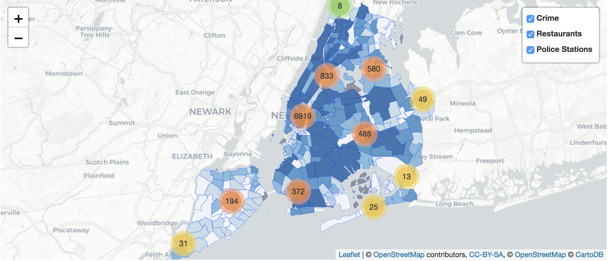

# Project 2: Open Data App - an RShiny app development project - A Safeguard for Foodie to Explore Gourmet in NYC

### [Project Description](/project2_desc.md)


## Project Title "Foodie Safeguard"
Term: Fall 2018
#################################################
Final Version: [Project 2 by Group 7](https://xinrouli.shinyapps.io/where_to_party2/)

+ Team #07

 + team member 1: Mengqi Chen
 + team member 2: Shiqing Long
 + team member 3: Anke Xu
 + team member 4: Sen Fu

+ **Project summary**: 
This project mainly focuses on the relation between crimes and restaurants of year 2018 happened in the new yrok city. Our shiny app is desiged to help people find the safest place to eat. And We tried to provide new visitors who want to have tasty food but also have concerns about safety with some suggestions

###################################################
 + (1)Overall crime trend, pattern that crime happened, and crime types difference in each boroughs, and offense level.
 + (2)Which nieghborhood is dangerous? How many crime happened in each neighborhood?
 + (3)Which restaurant to eat when considering price and rating, date, time, and borough?
 + (4)For a selected restaurants, how many crimes happped there during period of Jan,2018 to March,2018?
 + (5) What is the nearest NYPD station to ask for help?

We visualize the information about restaurants and crimes using geograph, time series plot, animated bar chart and animated scatter plot using ploty package.
And we visualize the combination of the information about restaurants and crimes on NYC map using leaflet package.
##############################################



Our Target Users:
1. Travellers who are new to a place and want to have something to eat
2. Restaurants Owner who want to relocate
3. NYPD
###############################################


In this second project of GR5243 Applied Data Science, we develop an *Exploratory Data Analysis and Visualization* shiny app on a topic of your choice using NYC open data released on the ############################[data.gov](https://data.gov/) website and (https://opendata.cityofnewyork.us). See [Project 2 Description](doc/project2_desc.md) for more details.  

The **learning goals** for this project is:

- Design and Develop Shiny App/Shiny Server to facilitate users with decision making
- Using Data Science techniques to find business intelligence from data
- Data Merging, Processing and Visualization using Animated Plot, Interactive Geograph
- Design Product to improve user experience and efficiency


*The above general statement about project 2 can be removed once you are finished with your project. It is optional.


+ **Contribution statement**:
###########################################################################################################
Mengqi Chen: Grasped and cleaned "party" data; and in charge of the summary of party data including a bar map, histograms showing the number of parties in months and the location type of parties in boroughs.

Shiqing Long: Cleaned Crime data, Exploratory Data Analysis using package "Plotly", plotted time series plot with range slider and selector buttons, animated scatter plot with mulitple trace, interactive heatmap and animated barchart and summurized business insights. Merged, processed restaurant data to compute the number of crimes around a given restaurants. Added pictures to modify project. Wrote github readme file.

Keran Li: Cleaned "nypd17" dataset and "felonyint" dataset. Visualized crime data (the pie plot) and coded the interactive pictures ("seven felony", "five boroughs crime" and "location overlap") in the "Crime Analysis" page. Built the ui and server of it. Helped integrate and combine the final shiny app. Wrote github readme file.

Xinlei Cao: Data cleaning and processing including the conversion of format, etc.; Built parts of the UI interface of the interactive map(the ui.R); Coding and realization of parts of algorithms of the interactive map including the visualization of the data of parties in NYC and the data of crime(the server.R).

Xinrou Li: Wrote codes about cleaning "Crime" dataset. Coded parts of the interactive map about visualization of the party location and selection panel. Built the overall UI structure. Combined all members' codes together(including server.R and ui.R), and organized and modified them to be consistent. 

All team members contributed equally in all stages of this project. All team members approve our work presented in this GitHub repository including this contributions statement.

##############################################
Following [suggestions](http://nicercode.github.io/blog/2013-04-05-projects/) by [RICH FITZJOHN](http://nicercode.github.io/about/#Team) (@richfitz). This folder is orgarnized as follows.

```
proj/
├── app/
├── lib/
├── data/
├── doc/
└── output/
```

Please see each subfolder for a README file.


